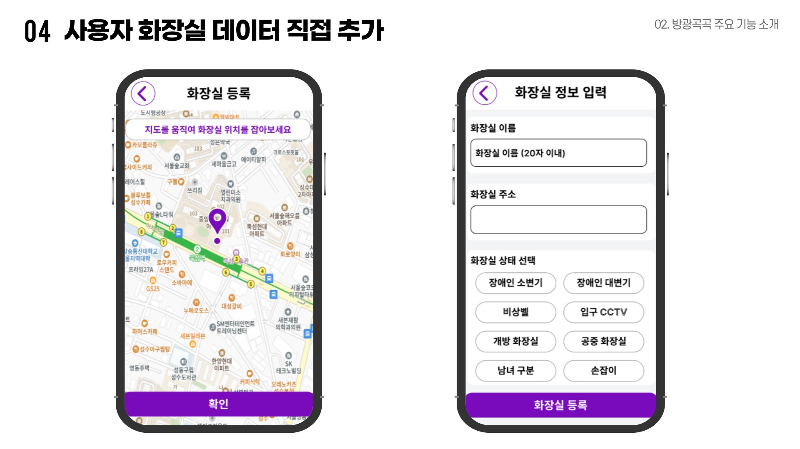

  <h1>방광곡곡 : 장애인 화장실 위치 공유 플랫폼</h1>
  <h3>2024 현대오토에버 배리어프리 앱 개발 콘테스트 
    국립교육특수원 원장상(3위)
  </h3>

  
   

  <h2><a href="https://play.google.com/store/apps/details?id=com.dream.disabledtoilet_android">[🔗 구글 플레이 스토어 Click !]</a> 👈</h2>

> 새 창 열기 방법 : CTRL+click (on Windows and Linux) | CMD+click (on MacOS)

 

# 📹 시현 영상

  

  

# 🛠 기술 스택

  
  
   
  
  
  
   
  <a href="https://www.figma.com/design/upaCysgW7Nx2phiAeRD48A/%EB%B0%A9%EA%B4%91%EA%B3%A1%EA%B3%A1?node-id=1261-218&p=f&t=HO5uRqBZyeAg7IJF-0">
    <b>FIGMA 바로가기</b>
  </a>

 

# 💡 프로젝트 배경

# 💡 주요 기능 5가지

<h2>1️⃣ Kakao Map에서 위치 기반 화장실 검색 </h2>  
👉 사용자가 현재 위치를 기준으로 지도에서 화장실을 확인하거나, 목적지를 검색하여 거리순/좋아요순 정렬된 리스트를 확인할 수 있습니다.  
 

 

`KakaoMap API`
`FusedLocationProviderClient`
`Google Play Services Location API`

 

 
 
 

<h2>2️⃣ 지도 위 마커 클릭 이벤트 발생 시 화장실 상세 페이지 이동 </h2>

👉 지도 위에서 마커를 클릭하면 해당 화장실의 상세 페이지로 이동하며, 상세 조건을 동적으로 UI에 반영하고, 네비게이션 연결 및 카카오톡 공유 기능을 제공합니다.
 

 

`KakaoMap API`
`ViewModel`
`LiveData`
`ConstraintLayout`
`Kotlin Serialization`
`Kakao SDK`
`Implicit Intent (Android)`

 

 
 
 

<h2>3️⃣ 조건 적용 필터링으로 사용자가 원하는 화장실만 모아보기 </h2>

👉 사용자가 설정한 조건(예: 장애인 화장실 여부, 남녀 공용 여부 등)에 따라 필터링하여 원하는 화장실만 리스트에서 확인할 수 있습니다.  

`Firebase Firestore`
`Jetpack Paging`
`RecyclerView`
`DataStore (Jetpack)`

 

 

 
 
 

<h2>4️⃣ 사용자가 직접 화장실을 등록하면 Firebase에 실시간 업로드 후 지도 반영 </h2>
👉 사용자가 직접 화장실을 추가할 수 있으며, 데이터는 Firebase Firestore에 저장된 후 자동으로 지도에 반영됩니다.  

`Firebase Firestore`
`KakaoMap API`

 

 
 
 

<h2>5️⃣ 좋아요 한 화장실을 그룹별로 모아보는 그룹화 기능 </h2>
👉 사용자가 좋아요한 화장실을 그룹별로 저장하고, 필요할 때 그룹 단위로 리스트에서 확인할 수 있습니다.  

`Firebase Firestore`
`RecyclerView`
`DiffUtil`
`ViewModel`
`LiveData`

 

 

 

# 📅 개발 일정
<table style="border: 2px solid white; border-radius: px; overflow: hidden;">
  <tr style="background-color: lightgrey; ">
    <th>구분</th>
    <th>추진 내용</th>
    <th>추진 기간</th>
    <th>세부 내용</th>
  </tr>
  <tr>
    <td><b>1</b></td>
    <td><b>서비스 기획</b></td>
    <td>24.04 ~ 24.06</td>
    <td>국내외 시장 현황 및 경쟁사 분석 복지관 2곳 직접 방문 인터뷰 후, 필요 기능 도출</td>
  </tr>
  <tr>
    <td><b>2</b></td>
    <td><b>오픈 API 기반 데이터 가공</b></td>
    <td>24.07 ~ 24.09</td>
    <td>공공데이터 포털(행정 안전 기획부 + 코레일, 국토교통부) 민간데이터 <b>1만 5,000+개</b> 가공</td>
  </tr>
  <tr>
    <td><b>3</b></td>
    <td><b>지도 API 개발</b></td>
    <td>24.09 ~ 24.09</td>
    <td><b>Kakao Map</b> 연결 및 사용자 현재 위치 비동기 처리</td>
  </tr>
  <tr>
    <td><b>4</b></td>
    <td><b>회원 로그인 연동</b></td>
    <td>24.09 ~ 24.10</td>
    <td><b>구글 로그인</b> 연동 디바이스에 사용자 로그인 상태 저장</td>
  </tr>
  <tr>
    <td><b>5</b></td>
    <td><b>조건 적용 필터링</b></td>
    <td>24.09 ~ 24.12</td>
    <td>화장실 데이터 가공 후 조건 옵션 세분화 조건 적용 화장실 데이터 필터링한 결과물 실시간 업데이트</td>
  </tr>
  <tr>
    <td><b>6</b></td>
    <td><b>화장실 내장소 저장</b></td>
    <td>24.10 ~ 25.01</td>
    <td>Firebase에 사용자 좋아요 클릭 이벤트 실시간 반영</td>
  </tr>
  <tr>
    <td><b>7</b></td>
    <td><b>화장실 직접 등록</b></td>
    <td>24.10 ~ 24.10</td>
    <td>사용자 현재 위치 기반 화장실 세부 내용 등록 Firebase 화장실 데이터베이스 업데이트</td>
  </tr>
  <tr>
    <td><b>8</b></td>
    <td><b>내 장소 그룹화</b></td>
    <td>24.11 ~ 25.02</td>
    <td>사용자가 저장한 화장실 데이터를 그룹별 지도에서 모아보기</td>
  </tr>
  <tr>
    <td><b>9</b></td>
    <td><b>버그 수정</b></td>
    <td>25.02 ~</td>
    <td>버그 수정 후, 스토어 출시 (ver 1.1.0)</td>
  </tr>
  <tr style="background-color: lightgrey; text-align: center; ">
    <td colspan="3"><b>개발 완료</b></td>
    <td><b>스토어 출시 1.0.4 현대 오토에버 배리어프리 앱 개발 콘테스트 3위</b></td>
  </tr>
</table>

 

# 🏆 수상 기록

<a href = "https://link.naver.com/bridge?url=http%3A%2F%2Fm.senews.kr%2F24565&dst=naversearchapp%3A%2F%2Finappbrowser%3Furl%3Dhttp%253A%252F%252Fm.senews.kr%252F24565%26version%3D10%26sourceReferer%3Dshare"><b> 🔗 뉴스 바로 가기 👈</b> 
</a>

  
  

